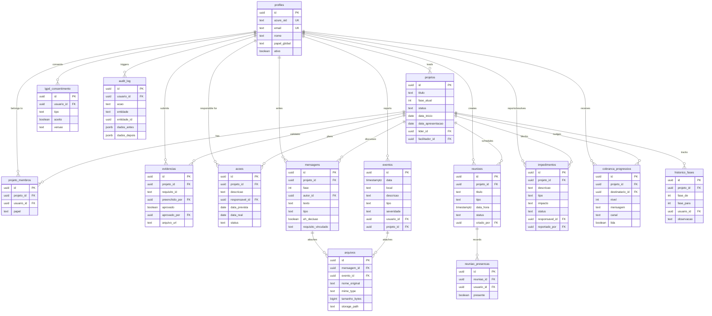

# ADAMBOOT MCO — Database Schema

## Overview

PostgreSQL managed by **Supabase**. 15 tables across 6 migrations.

## Entity Relationship Diagram

## Tables Summary

| #   | Table                  | Migration | Purpose                                     |
| --- | ---------------------- | --------- | ------------------------------------------- |
| 1   | `profiles`             | 001       | User profiles linked to Azure AD            |
| 2   | `projetos`             | 001       | CCQ improvement projects (8-phase A3/MASP)  |
| 3   | `projeto_membros`      | 001       | Project team membership (N:N)               |
| 4   | `evidencias`           | 001       | Phase requirement evidence/validation       |
| 5   | `acoes`                | 001       | 5W2H action plan items                      |
| 6   | `eventos`              | 002       | Operational events (incidents, near-misses) |
| 7   | `mensagens`            | 002       | Structured project conversation per phase   |
| 8   | `arquivos`             | 002       | File attachments (messages, events)         |
| 9   | `reunioes`             | 003       | Team meetings                               |
| 10  | `reuniao_presencas`    | 003       | Meeting attendance tracking                 |
| 11  | `impedimentos`         | 003       | Project blockers/impediments                |
| 12  | `audit_log`            | 004       | Audit trail (LGPD compliance)               |
| 13  | `lgpd_consentimento`   | 004       | LGPD consent records                        |
| 14  | `historico_fases`      | 004       | Phase transition history                    |
| 15  | `cobranca_progressiva` | 004       | AI progressive nudge system                 |

## Row Level Security (RLS)

All 15 tables have RLS enabled with policies matching project membership.

| Table                | SELECT                       | INSERT                         | UPDATE             | DELETE             |
| -------------------- | ---------------------------- | ------------------------------ | ------------------ | ------------------ |
| profiles             | Own + team members           | —                              | Own profile        | —                  |
| projetos             | Project members              | Leader creates                 | Leader/facilitator | —                  |
| projeto_membros      | Project members              | Leader/facilitator + self-join | —                  | Leader/facilitator |
| evidencias           | Project members              | Project members                | —                  | —                  |
| acoes                | Project members              | Project members                | Project members    | —                  |
| eventos              | Own events                   | Own insert                     | —                  | —                  |
| mensagens            | Project members              | Project members                | —                  | —                  |
| arquivos             | Via message/event membership | —                              | —                  | —                  |
| reunioes             | Project members              | Leader/facilitator             | Leader/facilitator | —                  |
| reuniao_presencas    | Via meeting membership       | Project members                | Project members    | —                  |
| impedimentos         | Project members              | Project members                | Leader/facilitator | —                  |
| audit_log            | Admin/coordinator only       | Authenticated users            | —                  | —                  |
| lgpd_consentimento   | Own records                  | Own insert                     | —                  | —                  |
| historico_fases      | Project members              | Leader/facilitator             | —                  | —                  |
| cobranca_progressiva | Own nudges                   | Leader/facilitator             | Own (mark read)    | —                  |

## Seed Data

3 demo projects at different stages:

| Project                             | Phase          | Status    | Team      |
| ----------------------------------- | -------------- | --------- | --------- |
| Falha em freio manual - vagoes GDE  | 4 (Causa Raiz) | Ativo     | 4 members |
| Falha sinalizacao sonora locomotiva | 2 (Desdobrar)  | Ativo     | 4 members |
| Reducao desgaste trilhos curvos     | 8 (Padronizar) | Concluido | 4 members |

4 demo users: Gregory (lider), Carlos (membro), Joao (membro), Marcos (facilitador).

## Migrations

| File                            | Description                                                                         |
| ------------------------------- | ----------------------------------------------------------------------------------- |
| `001_core_tables.sql`           | profiles, projetos, projeto_membros, evidencias, acoes                              |
| `002_eventos_conversa.sql`      | eventos, mensagens, arquivos                                                        |
| `003_reunioes_impedimentos.sql` | reunioes, reuniao_presencas, impedimentos                                           |
| `004_audit_lgpd.sql`            | audit_log, lgpd_consentimento, historico_fases, cobranca_progressiva, triggers, RLS |
| `005_seed_data.sql`             | Demo data (2 projects, 4 users, events, messages)                                   |
| `006_rls_fixes_seed3.sql`       | RLS policy fixes + 3rd completed project seed                                       |

## Architecture Decision: No Edge Functions

**Decision:** Edge Functions are not used in the current architecture.

**Rationale:**

- Step progression validation runs client-side (deterministic rules in `phase-engine.ts`)
- Report generation is mock/client-side (future: backend PDF via Supabase Edge Function)
- Audit logging can use Supabase database triggers
- The app operates offline-first, so server-side validation would break the offline model

**When to reconsider:** If Supabase is used for real multi-user production, Edge Functions should handle step progression validation to prevent race conditions.
